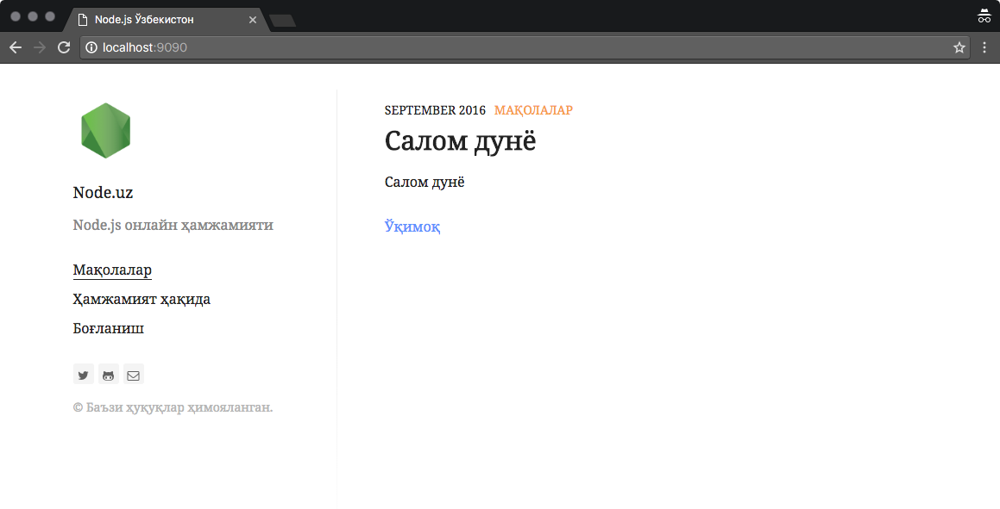

# Node.uz

Node.js платформасида ишлайдиган ўзбекзабон дастурчилари онлайн ҳамжамияти

## Асосий талаблар
* React кутубхонаси
* Lodash кутубхонаси
* Moment.js кутубхонаси
* Webpack
* ES2016

## Ўрнатиш тартиби
1. `$ npm install`
2. `$ bower install`

## Локал муҳитда ишга тушириш
`gatsby develop`

## Лицензия
MIT
